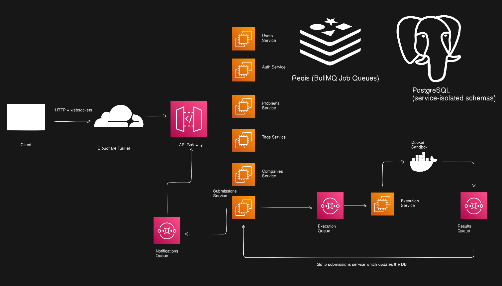
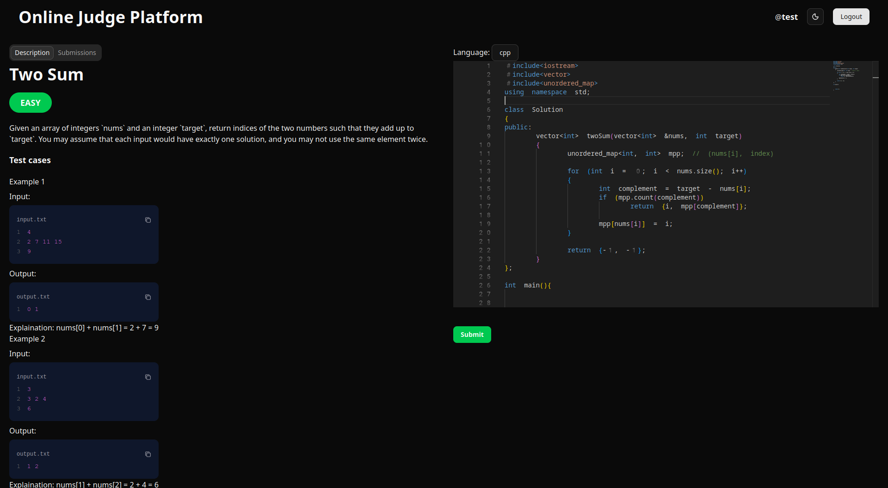
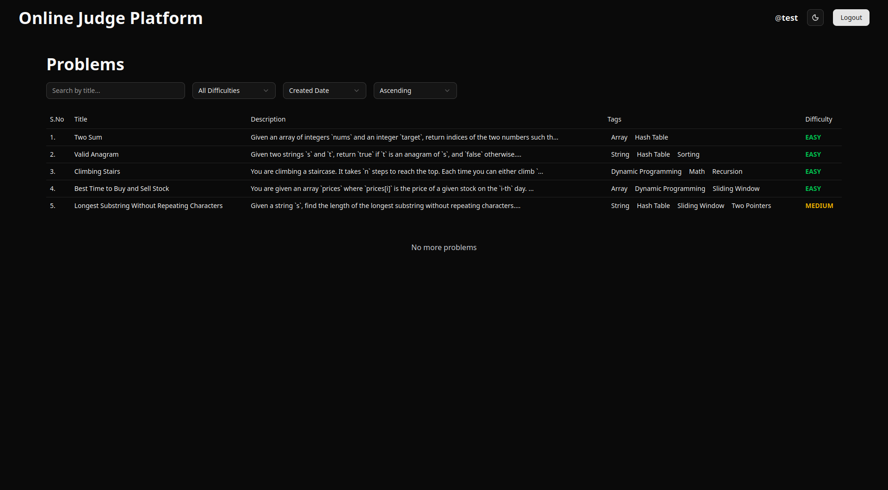
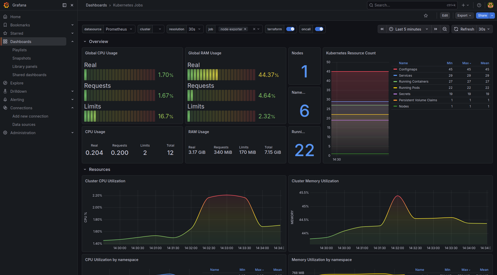

# 👨🏻‍⚖️ Online Judge Platform

A fully-featured, scalable LeetCode-style online judge built using a modern microservices architecture.
Includes real-time code execution, WebSockets, problem solving interface with Monaco Editor, authenticated user system, distributed queues, and Docker-based isolated execution.

## 🏗️ Architecture

This project uses a microservices architecture with 7 independent services communicating through an API Gateway.



| Service Name            | Port | Description                             |
| ----------------------- | ---- | --------------------------------------- |
| **API Gateway**         | 5000 | Entry point, routing, WebSocket support |
| **Users Service**       | 5001 | User profiles and account management    |
| **Auth Service**        | 5002 | Authentication, JWT tokens, sessions    |
| **Problems Service**    | 5003 | Problem CRUD, metadata, difficulty      |
| **Tags Service**        | 5004 | Problem categorization and filtering    |
| **Companies Service**   | 5005 | Company tags and frequency tracking     |
| **Submissions Service** | 5006 | Code submission tracking and history    |
| **Execution Service**   | 5007 | Async code execution via BullMQ workers |

## 🎯 Key Features

- Real-time code execution with live feedback
- Monaco Editor with syntax highlighting
- Docker-based sandboxed execution environment
- Distributed job processing with BullMQ
- Full monitoring stack (Prometheus + Grafana + Loki)
- CI/CD pipeline with GitHub Actions
- JWT authentication with refresh tokens
- Email verification and password reset

## ⚙️ Tech Stack

### Frontend

- Beautiful UI with shadcn/ui
- Problem-solving interface with Monaco Editor
- Live submission updates using Socket.IO
- Global state management with Zustand
- Fully typed with TypeScript
- Form handling with React Hook Form
- API interactions using Axios
- Tailwind CSS styling
- Day.js for handling timestamps and dates

### Backend

- NestJS for all microservices
- Redis + BullMQ for distributed queues
- PostgreSQL (shared DB, Prisma ORM)
- Socket.IO (real-time communication)
- Docker containers for isolated code execution
- JWT authentication
- Event-driven architecture

### DevOps & Infrastructure

- **Docker & Docker Compose** - Containerized microservices orchestration
- **GitHub Actions** - Automated CI/CD pipeline
- **Prometheus** - Metrics collection and monitoring
- **Grafana** - Visualization dashboards for system metrics
- **Loki** - Centralized log aggregation
- **BullMQ + Redis** - Distributed job queues for async processing
- **Nginx** - Reverse proxy and load balancing

## ⚙️ Execution Pipeline

- User clicks "Submit" → Frontend sends code via WebSocket to API Gateway
- API Gateway → TCP request to Submission Service
- Submission Service → Publishes job to execution-queue (BullMQ)
- Execution Service → Consumes job from queue
- Execution Service → Runs code in sandboxed Docker container
- Workers → Return execution result
- Execution Service → Publishes result to results-queue
- Submission Service → Consumes result from queue
- Submission Service → Updates database with status/results
- Submission Service → Publishes notification to notifications-queue
- API Gateway → Consumes notification event
- API Gateway → Pushes real-time update through WebSocket to user's browser

## ✨ Why Microservices?

- Each service deploys independently
- Execution workload isolated from main API
- Faster horizontal scaling
- Services communicate through queues → highly resilient
- Matches real LeetCode-scale architecture

## 📷 Screenshots

### Application




### Grafana



## 🚶🏻‍♂️ Getting started and 🏃🏻‍♂️ Running the app

Clone the repo

```bash
$ git clone https://github.com/naman22a/online-judge-platform
$ cd online-judge-platform
```

copy env files

```bash
$ cp .env.example .env
$ cp ./apps/client/.env.example ./apps/client/.env
```

run the backend (microservices)

- add `/tmp` to docker desktop file sharing

```bash
$ docker plugin install grafana/loki-docker-driver:3.3.2-arm64 --alias loki --grant-all-permissions
$ docker compose up
```

run the frontend

```bash
$ cd ./apps/client
$ pnpm install
$ pnpm dev
```

### 📊 Monitoring Dashboards

After running `docker compose up`, access:

- Grafana: http://localhost:3001 (default: admin/admin)
- Prometheus: http://localhost:9090

### 🧪 Running Tests

```bash
$ pnpm test
```

## 📡 API Features (OpenAPI 3.0)

This project includes a complete OAS 3.0 compliant REST API.

### 👤 Users API

| Method | Endpoint          | Description             |
| ------ | ----------------- | ----------------------- |
| GET    | `/api/users`      | Get all users           |
| PATCH  | `/api/users`      | Update own user details |
| GET    | `/api/users/me`   | Get authenticated user  |
| GET    | `/api/users/{id}` | Get user by ID          |

### 🔐 Auth API

| Method | Endpoint                           | Description                   |
| ------ | ---------------------------------- | ----------------------------- |
| POST   | `/api/auth/register`               | User registration             |
| POST   | `/api/auth/confirm-email/{token}`  | Email verification            |
| POST   | `/api/auth/login`                  | Login using credentials       |
| POST   | `/api/auth/logout`                 | Logout and invalidate session |
| POST   | `/api/auth/refresh_token`          | Refresh JWT access token      |
| POST   | `/api/auth/forgot-password`        | Generate password reset link  |
| POST   | `/api/auth/reset-password/{token}` | Reset password                |

### 🧠 Problems API

| Method | Endpoint               |
| ------ | ---------------------- |
| GET    | `/api/problems`        |
| POST   | `/api/problems`        |
| GET    | `/api/problems/{slug}` |
| DELETE | `/api/problems/{id}`   |
| PATCH  | `/api/problems/{id}`   |

### 🏷️ Tags API

| Method | Endpoint         |
| ------ | ---------------- |
| GET    | `/api/tags`      |
| GET    | `/api/tags/{id}` |
| POST   | `/api/tags/bulk` |

### 🏢 Companies API

| Method | Endpoint              |
| ------ | --------------------- |
| GET    | `/api/companies`      |
| GET    | `/api/companies/{id}` |
| POST   | `/api/companies/bulk` |

## 📝 Submissions API

| Method | Endpoint                |
| ------ | ----------------------- |
| GET    | `/api/submissions/{id}` |

## 📁 Folder Structure

```
.
├── apps
│   ├── api-gateway
│   ├── auth-service
│   ├── client
│   ├── companies-service
│   ├── execution-service
│   ├── problems-service
│   ├── submissions-service
│   ├── tags-service
│   └── users-service
├── assets
│   ├── architecture.png
│   ├── problems.png
│   └── two-sum.png
├── docker-compose.dev.yml
├── docker-compose.yml
├── Dockerfile.base
├── Dockerfile.web
├── .dockerignore
├── .env
├── .env.example
├── .env.test
├── .gitignore
├── LICENSE
├── nginx.conf
├── .npmrc
├── package.json
├── packages
│   ├── config
│   ├── constants
│   ├── database
│   ├── eslint-config
│   ├── types
│   └── typescript-config
├── pnpm-lock.yaml
├── pnpm-workspace.yaml
├── .prettierignore
├── .prettierrc
├── README.md
├── tsconfig.json
└── turbo.json
```

## 🤝 Contributions

Contributions, issues, and suggestions are welcome! Feel free to fork the repository and submit pull requests.

## 📫 Stay in touch

- Author - [Naman Arora](https://namanarora.xyz)
- Twitter - [@naman_22a](https://x.com/naman_22a)

## 🗒️ License

Online Judge Platform is [GPL V3](./LICENSE)
